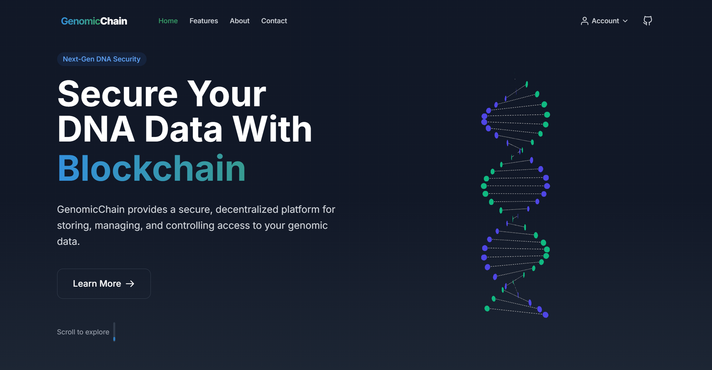
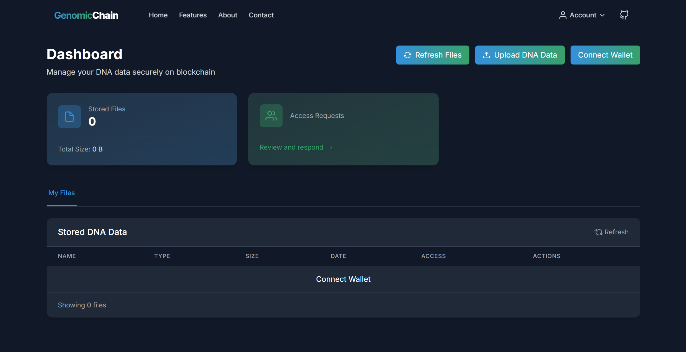

# Hardhat Project

This project is a blockchain-based solution for securely storing and managing genomic data. It leverages the Hardhat development environment to compile, deploy, and test smart contracts. The project includes a sample contract, tests, and deployment scripts to demonstrate its functionality.

The system allows users to upload genomic data to IPFS, manage access permissions using smart contracts, and interact with the blockchain through a user-friendly frontend.

### Project Screenshots





### To start a blockchain node
```
npx hardhat node
```

### For compile the the solidity contracts
```
npx hardhat compile
```

### For deploying the contract on the node
```
npx hardhat run scripts/deploy.js --network localhost
```

### Project Features
- **Blockchain Integration**: Uses Ethereum smart contracts for secure and decentralized data management.
- **IPFS Storage**: Stores genomic data on IPFS for efficient and distributed file storage.
- **Access Control**: Implements granular access control using smart contracts.
- **Frontend Interface**: Provides a user-friendly interface for uploading, managing, and accessing genomic data.

